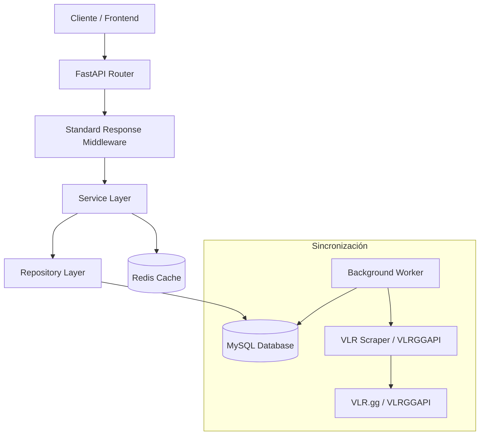

# 🎮 Fantasy Valorant API

Backend robusto y escalable para la plataforma Fantasy Valorant, construido con **FastAPI**, **SQLAlchemy 2.0** y **Redis**. Diseñado para alto rendimiento y consistencia de datos en tiempo real.

---

## 🏗️ Arquitectura del Sistema

El proyecto sigue una arquitectura limpia en capas (Clean Architecture) para asegurar mantenibilidad y testabilidad:



- **API Layer**: Routers (Endpoints) con validación Pydantic y autenticación JWT.
- **Middleware**: Envuelve automáticamente todas las respuestas JSON en el formato `StandardResponse`.
- **Service Layer**: Lógica de negocio pura. Orquestación de repositorios, cálculo de puntos, y gestión de caché.
- **Repository Layer**: Abstracción de acceso a datos usando SQLAlchemy 2.0 (Async).
- **Caching Layer**: Redis para datos de alto acceso (equipos, jugadores, estadísticas de partidos).

---

## 📦 Formato de Respuesta Estándar

Todas las respuestas de la API (excepto `/auth/login` y `/auth/refresh`) son envueltas automáticamente por un middleware:

```json
{
  "success": true,
  "data": { ... },
  "error": null
}
```

En caso de error, el formato es:

```json
{
  "success": false,
  "data": null,
  "error": {
    "code": "ERROR_CODE",
    "message": "Descripción del error"
  }
}
```

---

## 🗺️ Endpoints de la API (`/api/v1`)

### 🔐 Auth (`/auth`)

| Método   | Ruta                          | Descripción                       | Acceso                |
| -------- | ----------------------------- | --------------------------------- | --------------------- |
| `POST`   | `/auth/register`              | Registrar nuevo usuario           | Público               |
| `POST`   | `/auth/login`                 | Login y obtención de JWT          | Público               |
| `POST`   | `/auth/refresh`               | Renovar Access Token              | Público               |
| `GET`    | `/auth/me`                    | Perfil del usuario actual         | Auth                  |
| `GET`    | `/auth/`                      | Listar todos los usuarios         | Admin                 |
| `GET`    | `/auth/id/{user_id}`          | Buscar usuario por ID             | Auth (propio o admin) |
| `GET`    | `/auth/username/{username}`   | Buscar usuario por username       | Auth (propio o admin) |
| `GET`    | `/auth/email/{email}`         | Buscar usuario por email          | Auth (propio o admin) |
| `PUT`    | `/auth/{user_id}`             | Actualizar usuario                | Auth (propio o admin) |
| `PATCH`  | `/auth/{user_id}/change-role` | Cambiar rol de usuario            | Admin                 |
| `DELETE` | `/auth/{user_id}`             | Eliminar usuario                  | Auth (propio o admin) |
| `POST`   | `/auth/update-image`          | Subir foto de perfil (Cloudinary) | Auth                  |

### 🏟️ Torneos (`/tournaments`)

| Método | Ruta                           | Descripción              | Acceso |
| ------ | ------------------------------ | ------------------------ | ------ |
| `GET`  | `/tournaments`                 | Listar todos los torneos | Auth   |
| `GET`  | `/tournaments/ongoing`         | Obtener torneo en curso  | Auth   |
| `GET`  | `/tournaments/{tournament_id}` | Torneo por ID            | Auth   |

### ⚽ Ligas (`/leagues`)

| Método   | Ruta                                           | Descripción                   | Acceso                                |
| -------- | ---------------------------------------------- | ----------------------------- | ------------------------------------- |
| `GET`    | `/leagues`                                     | Listar todas las ligas        | Auth                                  |
| `GET`    | `/leagues/my`                                  | Ligas del usuario actual      | Auth                                  |
| `GET`    | `/leagues/{league_id}`                         | Liga por ID                   | Auth                                  |
| `GET`    | `/leagues/invite/{invite_code}`                | Liga por código de invitación | Auth                                  |
| `POST`   | `/leagues`                                     | Crear nueva liga              | Auth                                  |
| `PUT`    | `/leagues/{league_id}`                         | Actualizar liga               | Admin de liga                         |
| `DELETE` | `/leagues/{league_id}`                         | Eliminar liga                 | Admin de liga                         |
| `GET`    | `/leagues/{league_id}/members`                 | Miembros de una liga          | Auth                                  |
| `GET`    | `/leagues/{league_id}/rankings`                | Ranking de una liga           | Auth                                  |
| `POST`   | `/leagues/{league_id}/join`                    | Unirse a una liga             | Auth                                  |
| `GET`    | `/leagues/members/{member_id}`                 | Miembro por ID                | Auth                                  |
| `PATCH`  | `/leagues/members/{member_id}`                 | Actualizar miembro            | Auth (propio o admin)                 |
| `DELETE` | `/leagues/members/{member_id}`                 | Abandonar/expulsar miembro    | Auth (propio, admin de liga, o admin) |
| `GET`    | `/leagues/members/{member_id}/roster`          | Roster completo del miembro   | Auth                                  |
| `GET`    | `/leagues/members/{member_id}/roster/starters` | Solo titulares                | Auth                                  |
| `GET`    | `/leagues/members/{member_id}/roster/bench`    | Solo suplentes                | Auth                                  |
| `POST`   | `/leagues/members/{member_id}/roster`          | Agregar jugador al roster     | Auth (propio o admin)                 |
| `PATCH`  | `/leagues/roster/{roster_id}`                  | Actualizar entrada de roster  | Auth (propio o admin)                 |
| `DELETE` | `/leagues/roster/{roster_id}`                  | Eliminar jugador del roster   | Auth (propio o admin)                 |

### 🎮 Datos Profesionales (`/professional`)

| Método | Ruta                                              | Descripción                                                                                  | Acceso |
| ------ | ------------------------------------------------- | -------------------------------------------------------------------------------------------- | ------ |
| `GET`  | `/professional/teams`                             | Equipos (filtro por `region`)                                                                | Auth   |
| `GET`  | `/professional/teams/{team_id}`                   | Equipo por ID                                                                                | Auth   |
| `GET`  | `/professional/players`                           | Jugadores (filtros: `team_id`, `role`, `region`, `min_price`, `max_price`, `top`, `sort_by`) | Auth   |
| `GET`  | `/professional/players/{player_id}`               | Jugador por ID                                                                               | Auth   |
| `GET`  | `/professional/players/{player_id}/price-history` | Historial de precios de un jugador                                                           | Auth   |

### 📊 Partidos (`/matches`)

| Método | Ruta                                 | Descripción                                                                                   | Acceso |
| ------ | ------------------------------------ | --------------------------------------------------------------------------------------------- | ------ |
| `GET`  | `/matches`                           | Partidos (filtros: `status_filter`, `team_id`, `tournament_id`, `unprocessed`, `recent_days`) | Auth   |
| `GET`  | `/matches/{match_id}`                | Partido por ID                                                                                | Auth   |
| `GET`  | `/matches/{match_id}/stats`          | Estadísticas de todos los jugadores en un partido                                             | Auth   |
| `GET`  | `/matches/players/{player_id}/stats` | Estadísticas de un jugador (filtro: `recent`)                                                 | Auth   |

### 🛠️ Admin (`/admin`)

| Método | Ruta                        | Descripción                                | Acceso |
| ------ | --------------------------- | ------------------------------------------ | ------ |
| `POST` | `/admin/sync-vlr`           | Sincronización manual de VLR en background | Admin  |
| `POST` | `/admin/recalibrate-prices` | Recalibrar precios de todos los jugadores  | Admin  |

### 🖼️ Proxy (`/proxy`)

| Método | Ruta                   | Descripción                                                            | Acceso  |
| ------ | ---------------------- | ---------------------------------------------------------------------- | ------- |
| `GET`  | `/proxy/image?url=...` | Proxy de imágenes externas (Liquipedia) para evitar hotlink protection | Público |

### ❤️ Health (`/healthy`)

| Método | Ruta       | Descripción               |
| ------ | ---------- | ------------------------- |
| `GET`  | `/healthy` | Health check del servidor |

---

## 🗄️ Modelos de Base de Datos

| Modelo             | Tabla                | Descripción                                              |
| ------------------ | -------------------- | -------------------------------------------------------- |
| `User`             | `users`              | Usuarios con roles (`user` / `admin`)                    |
| `Team`             | `teams`              | Equipos profesionales VCT                                |
| `Player`           | `players`            | Jugadores con precio, puntos, rol y foto                 |
| `PriceHistory`     | `price_history`      | Historial de precios de jugadores                        |
| `Match`            | `matches`            | Partidos con estado (`upcoming`, `live`, `completed`)    |
| `PlayerMatchStats` | `player_match_stats` | Estadísticas por jugador/partido (KDA, ACS, HS%, etc.)   |
| `Tournament`       | `tournaments`        | Torneos VCT (estado: `UPCOMING`, `ONGOING`, `COMPLETED`) |
| `TournamentTeam`   | `tournament_teams`   | Relación many-to-many torneo ↔ equipo                    |
| `League`           | `leagues`            | Ligas de fantasy                                         |
| `LeagueMember`     | `league_members`     | Miembros de una liga con su equipo y puntos              |
| `Roster`           | `roster`             | Jugadores en el equipo de un miembro (titular/suplente)  |

---

## ⚡ Estrategia de Caché (Redis)

Para garantizar latencias bajas en endpoints críticos, implementamos una estrategia inteligente:

| Recurso                      | Estrategia  | TTL | Descripción                                                     |
| :--------------------------- | :---------- | :-- | :-------------------------------------------------------------- |
| **Equipos**                  | `Agresiva`  | ∞   | Lista completa en Redis. Se invalida al crear/editar un equipo. |
| **Jugadores**                | `Agresiva`  | ∞   | Filtrado en memoria dentro de Redis para búsquedas complejas.   |
| **Partidos (Completed)**     | `Inmutable` | ∞   | Cacheados permanentemente. Datos históricos no cambian.         |
| **Partidos (Live/Upcoming)** | `No-Cache`  | 0   | Siempre consultados en tiempo real a la BD.                     |
| **Stats de partidos**        | `Inmutable` | ∞   | Stats de partidos completados cacheadas permanentemente.        |

> 🚀 **Nota:** La invalidación es automática en operaciones de escritura (Create/Update/Delete).

---

## 🔄 Sistema de Sincronización

El núcleo de datos se mantiene actualizado mediante un sistema híbrido:

1. **VLRGGAPI** (API no oficial):
   - Extrae metadatos de partidos: fechas, equipos, scores, estado (`completed`, `live`, etc.).
   - Fuente principal para estructura de partidos y resultados.

2. **VLR Scraper** (scraping de HTML de VLR.gg):
   - Extrae estadísticas detalladas de jugadores (KDA, ACS, HS%, agentes) desde la pestaña "All Maps".
   - Se usa exclusivamente para estadísticas de jugadores por su mayor precisión.

3. **Background Worker** (`app/worker.py`):
   - Proceso asíncrono que corre periódicamente (también disponible como servicio Docker).
   - Detecta torneos y partidos nuevos/finalizados.
   - Calcula **Fantasy Points** automáticamente al procesar estadísticas.
   - Actualiza rankings de ligas y estado de torneos.
   - Gestiona la **activación de jugadores** según el torneo en curso.

---

## 🛠️ Stack Tecnológico

| Categoría             | Tecnología                                                            |
| --------------------- | --------------------------------------------------------------------- |
| **Core**              | Python 3.11+, FastAPI                                                 |
| **Base de Datos**     | MySQL 8.0, SQLAlchemy 2.0 (AsyncIO), Alembic                          |
| **Caché**             | Redis 7                                                               |
| **Background Worker** | Asyncio Tasks (Custom Worker)                                         |
| **Media**             | Cloudinary (fotos de usuarios), Liquipedia Proxy (fotos de jugadores) |
| **Auth**              | JWT (RS256) — Access Token + Refresh Token                            |
| **HTTP Client**       | HTTPX (para proxy de imágenes y scraping)                             |
| **Contenedores**      | Docker, Docker Compose                                                |

---

## 🚀 Guía de Desarrollo

### Requisitos

- Python 3.11+
- Docker y Docker Compose (recomendado)
- Redis (local o Docker)
- MySQL 8.0 (local o Docker)

### Opción A: Con Docker Compose (Recomendado)

El `docker-compose.yml` levanta 4 servicios automáticamente:

| Servicio         | Puerto | Descripción            |
| ---------------- | ------ | ---------------------- |
| `fantasy_db`     | 3308   | MySQL 8.0              |
| `fantasy_redis`  | 6379   | Redis 7                |
| `fantasy_api`    | 8000   | FastAPI app            |
| `fantasy_worker` | —      | Background sync worker |

```bash
# 1. Copiar y configurar variables de entorno
cp .env.example .env
# Editar .env con tus credenciales

# 2. Levantar todos los servicios
docker-compose up -d --build

# 3. Aplicar migraciones (primera vez)
docker-compose exec api alembic upgrade head
```

### Opción B: Desarrollo Local (Sin Docker)

```bash
cd Backend
python -m venv venv
source venv/bin/activate  # o venv\Scripts\activate en Windows
pip install -r requirements.txt
```

Renombrar `.env.example` a `.env` y configurar credenciales de BD y Redis.

### Base de Datos (Alembic)

```bash
# Crear nueva migración (tras modificar modelos)
alembic revision --autogenerate -m "descripcion_cambio"

# Aplicar migraciones
alembic upgrade head

# Ver estado actual
alembic current
```

### Ejecutar Servidor

```bash
# Modo desarrollo con hot-reload
uvicorn app.main:app --reload
```

La documentación interactiva estará disponible en:

- **Swagger UI**: `http://localhost:8000/docs`
- **ReDoc**: `http://localhost:8000/redoc`

### Ejecutar Worker

```bash
# Proceso de sincronización independiente
python app/worker.py
```

---

## 📁 Estructura del Proyecto

```
Backend/
├── app/
│   ├── api/
│   │   ├── deps.py               # Dependencias de servicios (inyección)
│   │   └── v1/
│   │       ├── __init__.py       # Registro de todos los routers
│   │       ├── tournaments.py    # Router de torneos
│   │       └── endpoints/
│   │           ├── admin.py      # Endpoints de administración
│   │           ├── healthy.py    # Health check
│   │           ├── leagues.py    # Ligas, miembros y rosters
│   │           ├── matches.py    # Partidos y estadísticas
│   │           ├── professional.py # Equipos y jugadores
│   │           ├── proxy.py      # Proxy de imágenes externas
│   │           └── user.py       # Auth y usuarios
│   ├── auth/
│   │   └── deps.py               # JWT, guards (get_current_user, allow_admin, etc.)
│   ├── core/
│   │   ├── config.py             # Settings desde .env
│   │   ├── constants.py          # ErrorCodes y constantes
│   │   ├── exceptions.py         # AppError y handlers de excepciones
│   │   └── redis.py              # Cliente y helpers de Redis
│   ├── db/
│   │   ├── models/               # Modelos SQLAlchemy
│   │   └── session.py            # AsyncSessionLocal
│   ├── repository/               # Capa de acceso a datos
│   ├── schemas/                  # Pydantic schemas (In/Out)
│   ├── scripts/                  # Scripts utilitarios
│   ├── service/
│   │   ├── image.py              # Cloudinary upload
│   │   ├── league.py             # LeagueService, LeagueMemberService, RosterService
│   │   ├── match.py              # MatchService, PlayerMatchStatsService
│   │   ├── player_activation.py  # Activación de jugadores por torneo
│   │   ├── professional.py       # TeamService, PlayerService
│   │   ├── rewards.py            # Sistema de recompensas
│   │   ├── sync.py               # SyncService (orquestación de sincronización)
│   │   ├── tournament.py         # TournamentService
│   │   ├── user.py               # UserService (registro, login, JWT)
│   │   └── vlr_scraper.py        # Scraper de VLR.gg y cliente VLRGGAPI
│   ├── main.py                   # App FastAPI, middlewares y exception handlers
│   └── worker.py                 # Background worker de sincronización
├── alembic/                      # Migraciones de BD
├── alembic.ini
├── docker-compose.yml
├── Dockerfile
├── entrypoint.sh
└── requirements.txt
```
