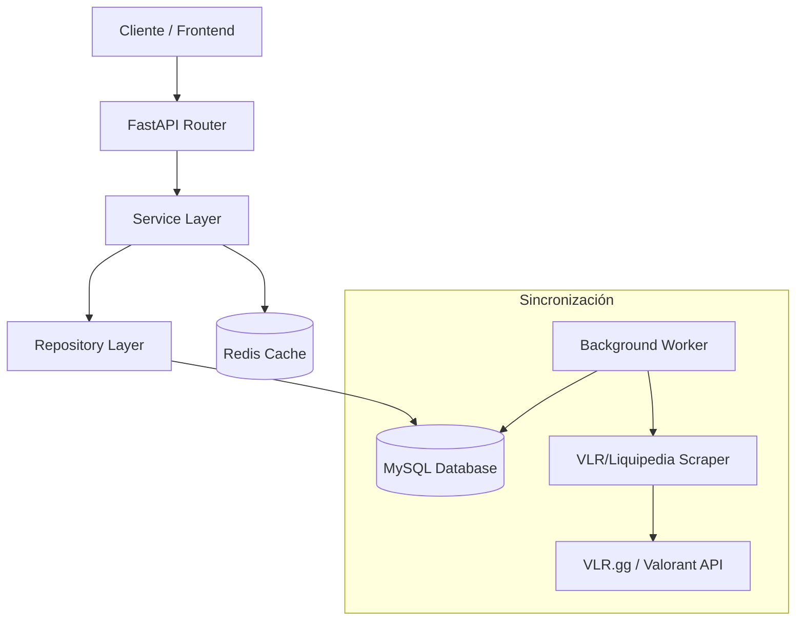

# 🎮 Fantasy Valorant API

Backend robusto y escalable para la plataforma Fantasy Valorant, construido con **FastAPI**, **SQLAlchemy 2.0** y **Redis**. Diseñado para alto rendimiento y consistencia de datos en tiempo real.

---

## 🏗️ Arquitectura del Sistema

El proyecto sigue una arquitectura límpia en capas (Clean Architecture) para asegurar mantenibilidad y testabilidad:



- **API Layer**: Controladores (Endpoints) que manejan la validación de entrada/salida (Pydantic) y autenticación.
- **Service Layer**: Lógica de negocio pura. Orquestación de repositorios, cálculo de puntos, y gestión de caché.
- **Repository Layer**: Abstracción de acceso a datos usando SQLAlchemy 2.0 (Async).
- **Caching Layer**: Redis para datos de alto acceso (Equipos, Partidos históricos).

---

## 🔄 Sistema de Sincronización

El núcleo de datos se mantiene actualizado mediante un sistema híbrido:

1.  **VLR Scraper & API**:
    - Extrae metadatos de partidos (fechas, equipos, torneos) usando la API no oficial de VLR.
    - Scrapea estadísticas detalladas de jugadores (KDA, ACS, HS%) directamente del HTML de VLR.gg para máxima precisión.
2.  **Background Worker**:
    - Proceso asíncrono que corre periódicamente (`app/worker.py`).
    - Detecta partidos finalizados recientemente.
    - Procesa estadísticas y calcula los **Fantasy Points** automáticamente.
    - Actualiza los rankings de las ligas de usuarios.

---

## ⚡ Estrategia de Caché (Redis)

Para garantizar latencias <50ms en endpoints críticos, implementamos una estrategia inteligente:

| Recurso                      | Estrategia  | TTL | Descripción                                                                       |
| :--------------------------- | :---------- | :-- | :-------------------------------------------------------------------------------- |
| **Equipos**                  | `Agresiva`  | ∞   | Se carga la lista completa en Redis. Se invalida solo al crear/editar un equipo.  |
| **Partidos (Completed)**     | `Inmutable` | ∞   | Los partidos finalizados se cachean permanentemente. Datos históricos no cambian. |
| **Partidos (Live/Upcoming)** | `No-Cache`  | 0   | Siempre se consultan en tiempo real a la BD.                                      |
| **Jugadores**                | `Agresiva`  | ∞   | Filtrado en memoria (dentro de Redis) para búsquedas complejas.                   |

> 🚀 **Nota:** La invalidación es automática en operaciones de escritura (Create/Update/Delete).

---

## 🛠️ Stack Tecnológico

- **Core**: Python 3.11+, FastAPI
- **Base de Datos**: MySQL 8.0, SQLAlchemy 2.0 (AsyncIO + Alembic)
- **Caché**: Redis
- **Background Actions**: Asyncio Tasks (Custom Worker)
- **Media**: Cloudinary (Optimización de imágenes)
- **Auth**: JWT (RS256)

---

## 🚀 Guía de Desarrollo

### Requisitos

- Python 3.11+
- Redis (Local o Docker)
- MySQL

### Configuración

1. Clonar repositorio y crear entorno virtual:

   ```bash
   cd Backend
   python -m venv venv
   source venv/bin/activate  # o venv\Scripts\activate en Windows
   pip install -r requirements.txt
   ```

2. Variables de entorno:
   Renombrar `.env.example` a `.env` y configurar credenciales de BD y Redis.

### Base de Datos

Manejo de migraciones con **Alembic**:

```bash
# Crear nueva migración (tras modificar modelos)
alembic revision --autogenerate -m "descripcion_cambio"

# Aplicar migraciones
alembic upgrade head
```

### Ejecutar Servidor

```bash
# Modo desarrollo con hot-reload
uvicorn app.main:app --reload
```

### Ejecutar Worker

```bash
# Proceso de sincronización independiente
python -m app.worker
```
